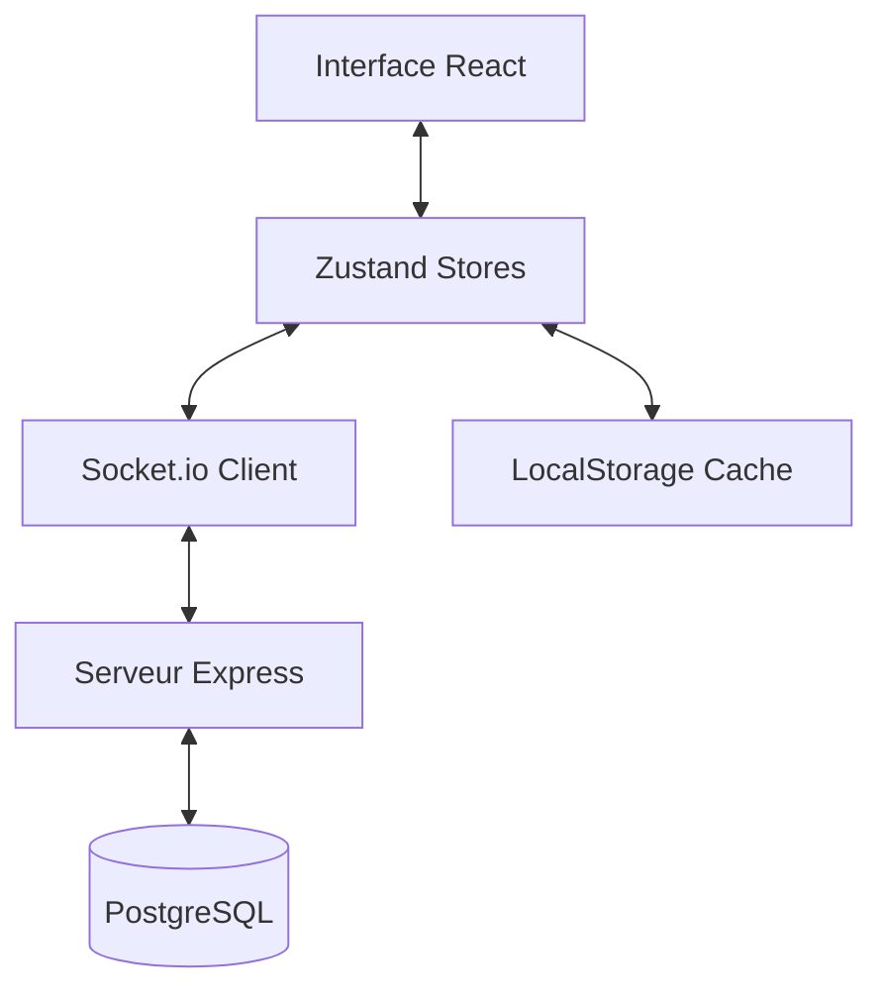

# Documentation Technique - Skyjo Virtual

Cette documentation détaille l'architecture, la logique et les systèmes qui composent l'application Skyjo Virtual.

---

## 🚀 Technologies Utilisées

### Frontend
- **React + Vite** : Framework principal pour l'interface utilisateur.
- **Tailwind CSS** : Système de styling utilitaire pour un design "Glassmorphism" premium.
- **Framer Motion** : Bibliothèque d'animations pour les transitions fluides et les effets visuels.
- **Lucide React** : Set d'icônes vectorielles.
- **Zustand** : Gestion d'état (State Management) légère et performante.

### Backend
- **Node.js + Express** : Serveur API et gestion des routes.
- **Socket.io** : Communication bidirectionnelle en temps réel (Gameplay multi, Chat, Présence).
- **PostgreSQL (Supabase)** : Base de données relationnelle pour les profils, amis, chat et feedbacks.

---

## 🏗️ Architecture Globale

L'application suit une séparation claire entre la vue (React), l'état (Zustand) et la persistance (PostgreSQL).

---

## 🧠 Gestion d'État (Zustand Stores)

L'intelligence du jeu est répartie dans 4 "Stores" principaux situés dans `src/store/` :

### 1. `gameStore.js`
Gère le profil local, l'XP, les niveaux et la configuration audio/vibration. C'est ici que l'identité de l'utilisateur est stockée.

### 2. `virtualGameStore.js`
Contient toute la logique mathématique du jeu Skyjo :
- Distribution des cartes (deck, défausse).
- Calcul des scores par colonne (règle des 3 cartes identiques).
- Gestion des tours de jeu (Joueur vs IA).

### 3. `onlineGameStore.js`
Extension du virtualGameStore dédiée au multijoueur :
- Gestion des salons (Rooms).
- Synchronisation des actions via Sockets.
- État des joueurs distants.

### 4. `socialStore.js`
Gère l'aspect communautaire :
- Liste d'amis et recherche par SkyID.
- Système de Chat privé (Style WhatsApp).
- Présence en temps réel ("En ligne", "En jeu").

---

## 🎮 Logique de Jeu (Multiplayer)

Le multijoueur repose sur un système d'événements Socket.io :

1.  **Création/Rejoint** : Le joueur crée une salle et reçoit un code unique.
2.  **Synchronisation** : Chaque action (piocher une carte, défausser, retourner) émet un événement au serveur qui le redistribue à tous les autres joueurs de la salle.
3.  **Validation** : Le serveur vérifie la validité des actions (par exemple, si c'est bien au tour du joueur de jouer).

---

## 💬 Communication & Chat

Le système de chat est conçu pour être global et asynchrone :
- **Pool de Sockets** : Le serveur associe chaque `userId` à une liste de sockets actifs. Si un utilisateur a plusieurs onglets ouverts, ils reçoivent tous le message instantanément.
- **Notifications Premium** : Un bandeau discret s'affiche au-dessus de la navbar en cas de message non lu, quel que soit l'onglet ouvert.

---

## 📲 PWA & Mise à jour

L'application est une Progressive Web App (PWA) :
- **Service Worker (`sw.js`)** : Gère la mise en cache des assets pour un chargement instantané.
- **Version Check** : Un système compare la version locale (`package.json`) avec la version serveur. Si une différence est détectée, une "Premium Pill" apparaît en haut de l'écran pour forcer le rafraîchissement des caches.

---

## 🛡️ Sécurité & Administration

- **Admin Dashboard** : Accessible via un code secret (hashé en SHA-256), il permet de monitorer les feedbacks et les utilisateurs en ligne.
- **Rate Limiting** : Protection contre le spam pour la soumission de feedbacks.
- **Sanitization** : Les données utilisateur (noms, IDs) sont nettoyées avant insertion en DB pour éviter les injections.

---

---

## 🔧 Gestion des Cas Limites et Correctifs

Cette section documente les solutions techniques apportées aux problèmes complexes de synchronisation et d'UX.

### 1. Gestion de la Déconnexion de l'Hôte (Host Quit)

**Problème :** Lorsqu'un hôte quittait ou annulait une partie, les clients étaient redirigés vers le menu principal avant d'avoir pu lire le message d'erreur, car le nettoyage de l'état (`gameState = null`) déclenchait une redirection automatique dans `VirtualGame.jsx`.

**Solution Technique :**
- **Priorité à l'Erreur :** Dans `VirtualGame.jsx`, la redirection vers le menu est bloquée tant que `onlineError` est présent dans le store `onlineGameStore`.
- **Overlay Persistant :** Le composant `HostLeftOverlay` est rendu explicitement si `!activeGameState` mais `onlineError` existe.
- **Réinitialisation Explicite :** La fonction `leaveRoom` du store a été modifiée pour remettre `error` à `null`, permettant à l'utilisateur de cliquer sur "Retour au menu" pour débloquer la redirection.

### 2. Suppression d'Ami Sécurisée

**Problème :** L'utilisation de `window.confirm` bloquait le thread UI et offrait une expérience visuelle pauvre (popup navigateur).

**Solution Technique :**
- **UI Custom :** Intégration de `ConfirmModal` (design Néon/Glass) dans `SocialMenu.jsx`.
- **Logique Serveur :** Ajout de la fonction `deleteFriend` manquante dans `socialStore.js` qui appelle la route API `/api/social/friends/delete`. La suppression est une action strictement **serveur** (requiert une mise à jour DB).

---

*Documentation mise à jour le 29 Janvier 2026 - Correctifs Host & Social.*
