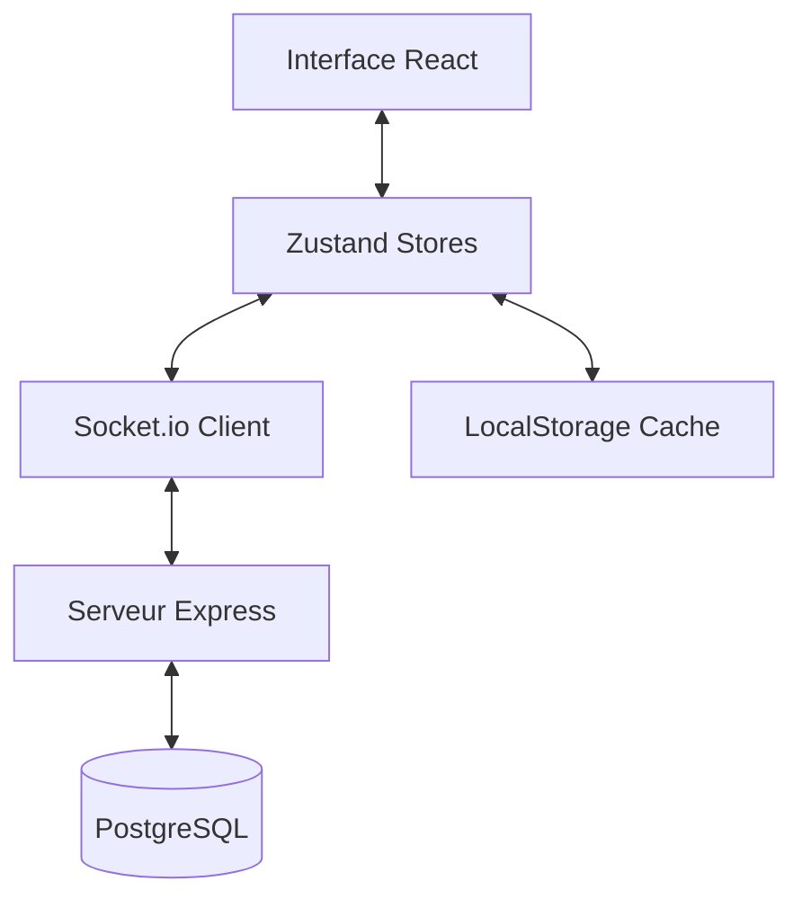
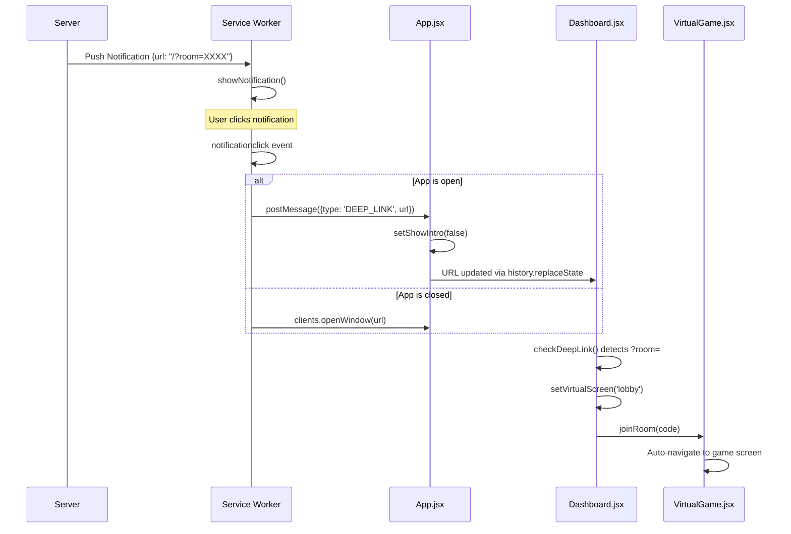

# Documentation Technique - Skyjo Virtual

Cette documentation détaille l'architecture, la logique et les systèmes qui composent l'application Skyjo Virtual.

---

## 🚀 Technologies Utilisées

### Frontend
- **React + Vite** : Framework principal pour l'interface utilisateur.
- **Tailwind CSS** : Système de styling utilitaire pour un design "Glassmorphism" premium.
- **Framer Motion** : Bibliothèque d'animations pour les transitions fluides et les effets visuels.
- **Lucide React** : Set d'icônes vectorielles.
- **Zustand** : Gestion d'état (State Management) légère et performante.

### Backend
- **Node.js + Express** : Serveur API et gestion des routes.
- **Socket.io** : Communication bidirectionnelle en temps réel (Gameplay multi, Chat, Présence).
- **PostgreSQL (Supabase)** : Base de données relationnelle pour les profils, amis, chat et feedbacks.

---

## 🏗️ Architecture Globale

L'application suit une séparation claire entre la vue (React), l'état (Zustand) et la persistance (PostgreSQL).

---

## 🧠 Gestion d'État (Zustand Stores)

L'intelligence du jeu est répartie dans 4 "Stores" principaux situés dans `src/store/` :

### 1. `gameStore.js`
Gère le profil local, l'XP, les niveaux et la configuration audio/vibration. C'est ici que l'identité de l'utilisateur est stockée.

### 2. `virtualGameStore.js`
Contient toute la logique mathématique du jeu Skyjo :
- Distribution des cartes (deck, défausse).
- Calcul des scores par colonne (règle des 3 cartes identiques).
- Gestion des tours de jeu (Joueur vs IA).

### 3. `onlineGameStore.js`
Extension du virtualGameStore dédiée au multijoueur :
- Gestion des salons (Rooms).
- Synchronisation des actions via Sockets.
- État des joueurs distants.

### 4. `socialStore.js`
Gère l'aspect communautaire :
- Liste d'amis et recherche par SkyID.
- Système de Chat privé (Style WhatsApp).
- Présence en temps réel ("En ligne", "En jeu").

---

## 🎮 Logique de Jeu (Multiplayer)

Le multijoueur repose sur un système d'événements Socket.io :

1.  **Création/Rejoint** : Le joueur crée une salle et reçoit un code unique.
2.  **Synchronisation** : Chaque action (piocher une carte, défausser, retourner) émet un événement au serveur qui le redistribue à tous les autres joueurs de la salle.
3.  **Validation** : Le serveur vérifie la validité des actions (par exemple, si c'est bien au tour du joueur de jouer).

---

## 💬 Communication & Chat

Le système de chat est conçu pour être global et asynchrone :
- **Pool de Sockets** : Le serveur associe chaque `userId` à une liste de sockets actifs. Si un utilisateur a plusieurs onglets ouverts, ils reçoivent tous le message instantanément.
- **Notifications Premium** : Un bandeau discret s'affiche au-dessus de la navbar en cas de message non lu, quel que soit l'onglet ouvert.

---

## 📲 PWA & Mise à jour

L'application est une Progressive Web App (PWA) :
- **Service Worker (`sw.js`)** : Gère la mise en cache des assets pour un chargement instantané.
- **Version Check** : Un système compare la version locale (`package.json`) avec la version serveur. Si une différence est détectée, une "Premium Pill" apparaît en haut de l'écran pour forcer le rafraîchissement des caches.

---

## 🛡️ Sécurité & Administration

- **Admin Dashboard** : Accessible via un code secret (hashé en SHA-256), il permet de monitorer les feedbacks et les utilisateurs en ligne.
- **Rate Limiting** : Protection contre le spam pour la soumission de feedbacks.
- **Sanitization** : Les données utilisateur (noms, IDs) sont nettoyées avant insertion en DB pour éviter les injections.

---

---

## 🔧 Gestion des Cas Limites et Correctifs

Cette section documente les solutions techniques apportées aux problèmes complexes de synchronisation et d'UX.

### 1. Gestion de la Déconnexion de l'Hôte (Host Quit)

**Problème :** Lorsqu'un hôte quittait ou annulait une partie, les clients étaient redirigés vers le menu principal avant d'avoir pu lire le message d'erreur, car le nettoyage de l'état (`gameState = null`) déclenchait une redirection automatique dans `VirtualGame.jsx`.

**Solution Technique :**
- **Priorité à l'Erreur :** Dans `VirtualGame.jsx`, la redirection vers le menu est bloquée tant que `onlineError` est présent dans le store `onlineGameStore`.
- **Overlay Persistant :** Le composant `HostLeftOverlay` est rendu explicitement si `!activeGameState` mais `onlineError` existe.
- **Réinitialisation Explicite :** La fonction `leaveRoom` du store a été modifiée pour remettre `error` à `null`, permettant à l'utilisateur de cliquer sur "Retour au menu" pour débloquer la redirection.

### 2. Suppression d'Ami Sécurisée

**Problème :** L'utilisation de `window.confirm` bloquait le thread UI et offrait une expérience visuelle pauvre (popup navigateur).

**Solution Technique :**
- **UI Custom :** Intégration de `ConfirmModal` (design Néon/Glass) dans `SocialMenu.jsx`.
- **Logique Serveur :** Ajout de la fonction `deleteFriend` manquante dans `socialStore.js` qui appelle la route API `/api/social/friends/delete`. La suppression est une action strictement **serveur** (requiert une mise à jour DB).

### 3. Gestion Audio & UI
- **Pill Header :** Unification des contrôles de jeu (Quitter, Son, Manche) dans un conteneur flottant "Pill" en verre dépoli.
- **Hook Audio :** `useBackgroundMusic` a été refactorisé pour empêcher le lancement de plusieurs pistes simultanées (Race Condition) et restreint aux phases de jeu actives (pas de musique en lobby).

### 4. Push Notifications & FCM (v2.5.1)

Le système de notifications repose sur **Firebase Cloud Messaging (FCM)**.

**Architecture Backend (`server/utils/pushNotifications.js`) :**
- **Initialisation Bulletproof** : La clé privée `FIREBASE_PRIVATE_KEY` est nettoyée et encapsulée dynamiquement dans un bloc PEM valide (support Windows/Linux).
- **Gestion des Tokens** : Nettoyage automatique des tokens obsolètes ou mal configurés (`mismatched-credential`).
- **Payload Data-Only** : Les notifications sont envoyées en mode `data` uniquement, permettant au Service Worker de décider de l'affichage (évite les doublons si l'app est ouverte).
- **TTL Android** : Les invitations expirent après 1h pour garantir la pertinence.

**Architecture Frontend (`src/hooks/usePushNotifications.js`) :**
- **Isolation Multi-Compte** : Les flags de vérification sont stockés sous `fcm_token_verified_{userId}` pour permettre à plusieurs joueurs d'utiliser le même appareil.
- **Forced Update** : Le changement de `FORCE_REFRESH_VER` (actuellement `v1.2.3`) déclenche un cycle complet de suppression/ré-inscription du token pour corriger les erreurs de configuration d'un clic.

### 5. Système de Récupération Sociale

En cas de perte d'accès (changement de navigateur sans exporter le SkyID), une procédure de fusion est disponible :
- **Logique de Fusion** : Les statistiques (Niveau, XP), les Amis et l'Historique d'un ancien ID technique peuvent être migrés vers le nouvel ID actif de l'utilisateur.
- **Intégrité** : Le script de fusion gère les doublons d'amitié et archive l'ancien compte pour préserver la cohérence du classements global.

---

## 🛠️ Variables d'Environnement (Firebase)

Pour que les notifications fonctionnent, les variables suivantes doivent être configurées sur Railway :
- `FIREBASE_PROJECT_ID` : L'ID du projet Firebase (`skyjo-b88ac`).
- `FIREBASE_CLIENT_EMAIL` : L'email du compte de service.
- `FIREBASE_PRIVATE_KEY` : La clé privée complète (formatée automatiqument par le serveur).
- `VITE_FIREBASE_SENDER_ID` : L'ID de l'expéditeur (utilisé par le client).

---

*Documentation mise à jour le 13 Février 2026 (v2.5.1) - Stabilité FCM & Recovery.*

**Correctifs clés :**
1. **`src/sw.js`** : Le push handler extrait maintenant `url` depuis la racine du payload (pas `data.data.url`).
2. **`src/App.jsx`** : Initialise `showIntro=false` si `?room=` est présent. Écoute les messages `DEEP_LINK` du SW.
3. **`src/components/Dashboard.jsx`** : Appelle `setVirtualScreen('lobby')` lors du deep-link pour activer l'auto-navigation de VirtualGame.

### 5. Indicateur de Source de Carte (v2.4.1)

**Problème :** En ligne, les joueurs étaient parfois confus de savoir si leur adversaire avait pioché dans la pile ou dans la défausse sans regarder attentivement l'animation.

**Solution Technique :**
- **State tracking :** Ajout de `drawnCardSource` ('pile' vs 'discard') dans les stores `virtualGameStore.js` et `onlineGameStore.js`.
- **Sync en temps réel :** Le serveur relaye l'origine de la carte via `game_update`.
- **UI contextuelle :** Le badge s'affiche dynamiquement sur la carte tirée avec des couleurs distinctes (Émeraude pour Pioche, Ambre pour Défausse).

### 6. Système de Citations & Réponses (Chat v2)

**Problème :** Difficulté de suivre une conversation active dans le chat social, surtout sur mobile où le clavier masque la moitié de l'écran.

**Solution Technique :**
- **Relai de contexte :** Ajout d'un champ `replyTo` optionnel dans le payload socket `private_message`. Le serveur relaye cet objet au destinataire.
- **Ergonomie Mobile :** Remplacement de l'UI par "hover" (Desktop) par un **clic direct** sur les bulles de message pour citer. 
- **Persistance :** Versionnage du store social (`version: 1`) pour garantir une réhydratation correcte après mise à jour du schéma de données.

---

*Documentation mise à jour le 06 Février 2026 (v2.4.1) - UI/UX & Chat Enhancements.*
